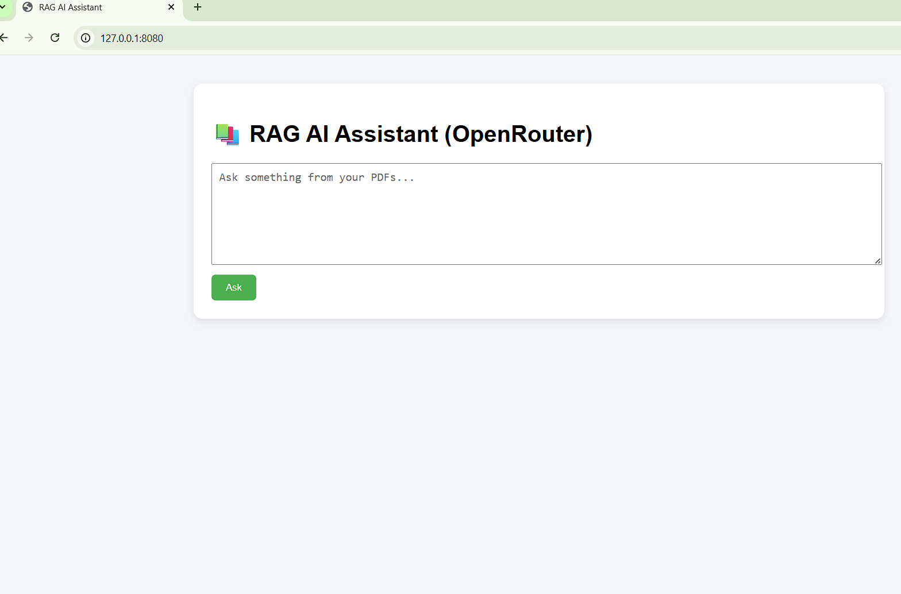
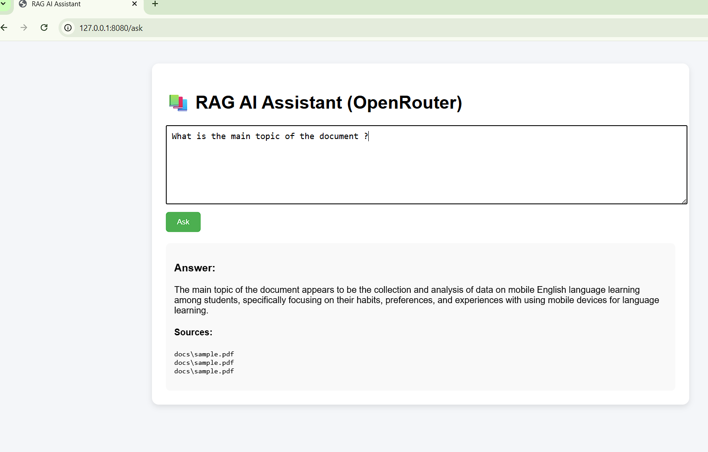
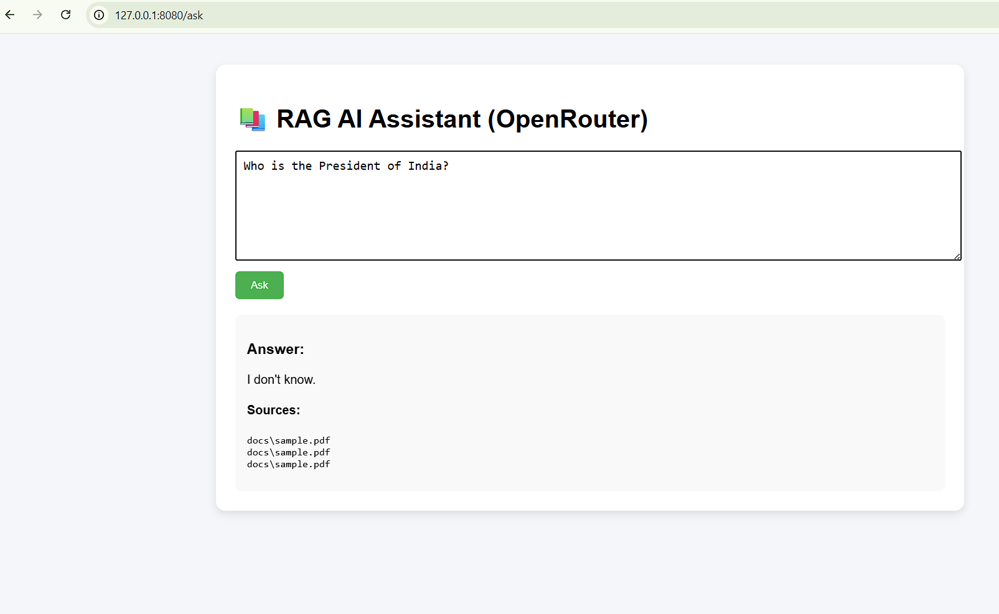

# 🔷 Retrieval-Augmented Generation (RAG) Based Intelligent QA System

## 📌 Project Overview

This project implements a Retrieval-Augmented Generation (RAG) based AI system that combines a Large Language Model (LLM) with a structured knowledge base to generate accurate and context-aware responses.

Unlike standalone LLM systems, this application first retrieves relevant information from uploaded documents using semantic search and then augments the LLM prompt with this retrieved context to reduce hallucination and improve reliability.

---

## 🎯 Key Features

- 📄 PDF Document Ingestion
- ✂️ Semantic Text Chunking
- 🔍 Vector-Based Similarity Search (FAISS)
- 🧠 Context-Aware Response Generation (OpenRouter LLM)
- 🌐 FastAPI Backend
- 💻 Basic Web Interface
- 📚 Source Attribution in Responses
- 🚫 Reduced Hallucination via Grounded Retrieval

---

## 🏗 System Architecture

The system follows a standard RAG pipeline:

```
User Query
   ↓
Embedding Model (MiniLM)
   ↓
FAISS Vector Database
   ↓
Top-K Relevant Chunks
   ↓
LLM (OpenRouter API)
   ↓
Final Context-Aware Response
```

---

## 🛠 Technology Stack

### 🔹 Backend
- Python
- FastAPI
- Uvicorn

### 🔹 LLM Integration
- OpenRouter API
  - GPT-4o-mini / Llama-3-8B-Instruct

### 🔹 Embeddings
- HuggingFace Sentence Transformers
  - all-MiniLM-L6-v2

### 🔹 Vector Database
- FAISS (Facebook AI Similarity Search)

### 🔹 Orchestration
- LangChain

### 🔹 Frontend
- HTML
- CSS
- Jinja2 Templates

---

## 📂 Project Structure

```
rag-ai-system/
│
├── app.py
├── rag_pipeline.py
├── requirements.txt
├── .env
├── docs/
│   └── sample.pdf
├── templates/
│   └── index.html
├── static/
│   └── style.css
└── README.md
```

---

## ⚙️ How to Run the Project

### 1️⃣ Clone Repository

```
git clone https://github.com/raza242k5-sys/rag-ai-system.git
cd rag-ai-system
```

### 2️⃣ Create Virtual Environment

```
python -m venv venv
venv\Scripts\activate
```

### 3️⃣ Install Dependencies

```
pip install -r requirements.txt
```

### 4️⃣ Create .env File

Create a `.env` file and add your OpenRouter API key:

```
OPENROUTER_API_KEY=your_api_key_here
```

### 5️⃣ Run Server

```
uvicorn app:app --reload --port 8080
```

### 6️⃣ Open in Browser

```
http://127.0.0.1:8080
```

---

## 📊 Evaluation Summary

The system was evaluated on:

- ✅ Retrieval relevance (Top-K similarity search accuracy)
- ✅ Hallucination reduction for out-of-scope queries
- ✅ Response latency (1.5–3 seconds average)
- ✅ Grounded response generation

Results show that the RAG architecture successfully improves answer reliability compared to standalone LLM responses.

---

## 🧪 Example Test Queries

- What is the main topic of the document?
- What framework is discussed?
- Summarize the uploaded PDF.
- Who is the President of India? (Out-of-scope test)

---

## 🚀 Future Improvements

- Persistent FAISS index storage
- Chat-style conversational interface
- Hybrid search (BM25 + Vector Search)
- Deployment on cloud platform
- Advanced evaluation metrics

---


## 📸 Project Screenshots

### 🖥 Home Page


### 🤖 Generated Answer with Sources


### 🚫 Hallucination Control Test


## 👨‍💻 Author

**Raza Rahman**  
Retrieval-Augmented Generation AI System  
2026